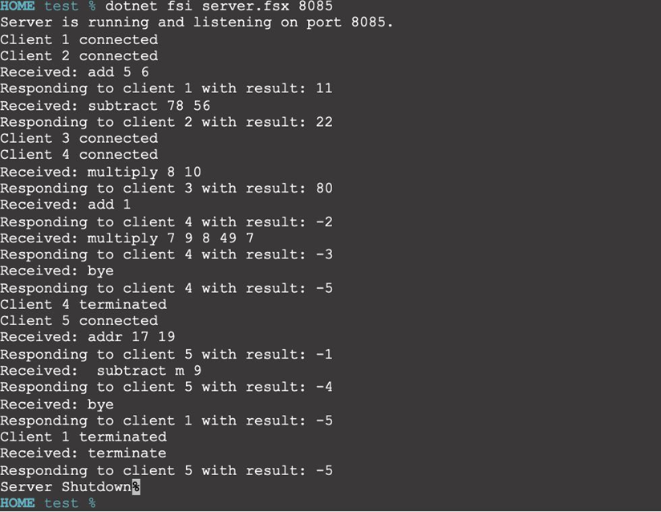
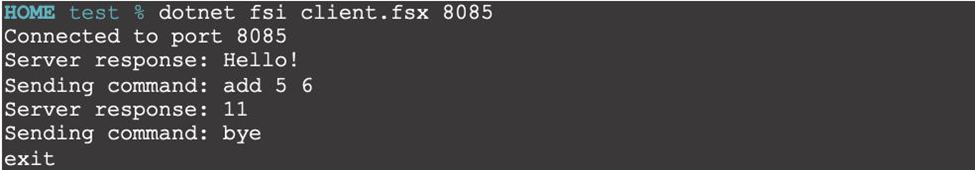
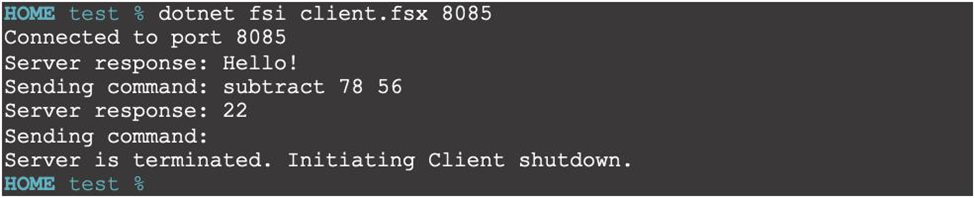
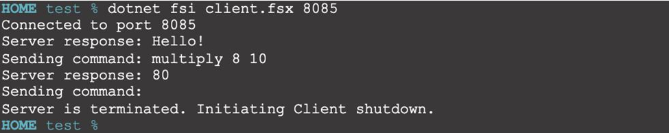
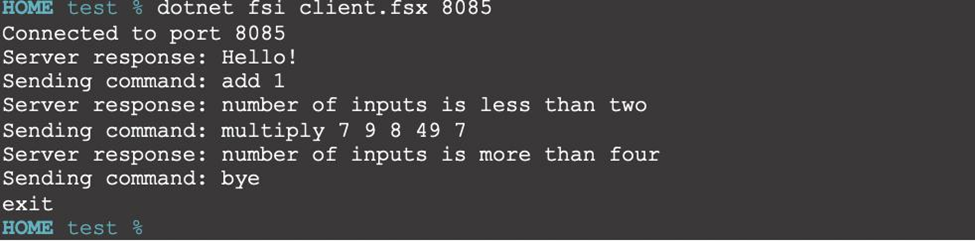
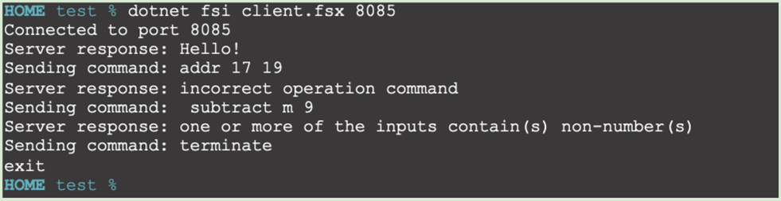

# Client-Server-Calculator

## Repository Overview
This project involves developing a concurrent client/server system using **F#** for socket communication. The project consists of a server program and multiple client programs that communicate using the **TCP/IP protocol** suite. The server listens for incoming client connections and processes arithmetic commands sent by the clients.

## Specifications
### Server Program
The server program continuously runs and accepts requests from multiple clients. It handles concurrent requests using asynchronous tasks in F#, allowing multiple clients to connect and send commands simultaneously. Upon receiving a command, the server processes the arithmetic operation and returns the result to the client.

**Key Features:**
- Listens for incoming connections.
- Handles multiple clients concurrently using asynchronous tasks.
- Responds with a "Hello!" message upon a new connection.
- Processes arithmetic commands (add, subtract, multiply) with up to four input numbers.
- Returns the result of the operation or an error code for invalid commands.
- Manages special commands:
    - bye: Closes the connection with the specific client.
    - terminate: Closes all connections and shuts down the server.

### Client Program
Clients connect to the server and send arithmetic commands. The client program supports concurrent and asynchronous communication with the server.

**Key Features:**
- Connects to the server and receives a "Hello!" message.
- Sends arithmetic commands to the server.
- Receives and displays results or error messages.
- Supports user input for commands.
- Manages special commands:
    - bye: Disconnects from the server.
    - terminate: Shuts down the server.
    
### Error Handling
The server program generates specific error codes for invalid commands:

- -1: Incorrect operation command.
- -2: Number of inputs is less than two.
- -3: Number of inputs is more than four.
- -4: One or more inputs contain non-numeric values.
- -5: Exit (triggered by the bye command).

When multiple errors occur, the server returns the error code of the highest precedence.

## Steps to run
### 1. Prerequisites
Ensure you have an environment that supports F# (e.g., .NET with F# installed) on your
computer. 
### 2. Open Terminals
Open two separate terminal windows or sessions on your computer.

### 3. Compile and Run the Server
- In one of the terminal windows, navigate to the directory containing server.fsx.
- Execute the following command to compile and run the server:
    ```
    $ dotnet fsi server.fsx <portno>
    ```
 Note that portno is optional, with the default port number being 8888.
 
### 4. Compile and Run the Client
- In another terminal window, navigate to the directory containing client.fsx.
- Execute the following command to compile and run the client:
    ```
    $ dotnet fsi client.fsx <portno>
    ```
Note that portno is optional, with the default port number being 8888.

If you want to test with multiple client connections, open additional terminal windows and repeat
step 3 to run multiple instances of the client.

## Demo
The following screenshots demonstrates the server in action, handling requests from five clients simultaneously.

### *Server*
<p align="center">
  
</p>

### *Client1*
<p align="center">
  
</p>

### *Client2*
<p align="center">
  
</p>

### *Client3*
<p align="center">
  
</p>

### *Client4*
<p align="center">
  
</p>

### *Client5*
<p align="center">
  
</p>

## Implementation Details
For detailed implementation information, please refer to the [project report](ClientServerReport.pdf).


